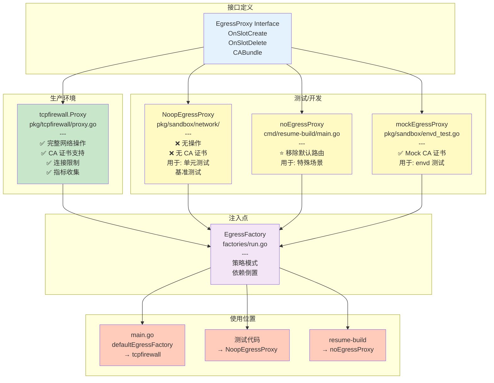
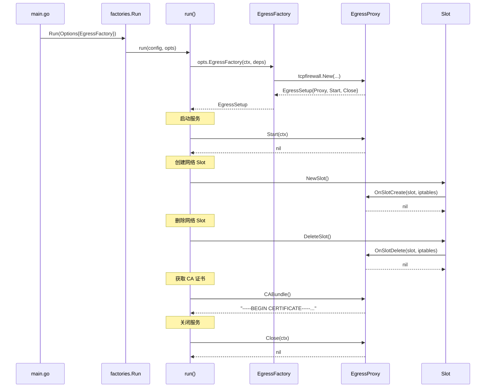
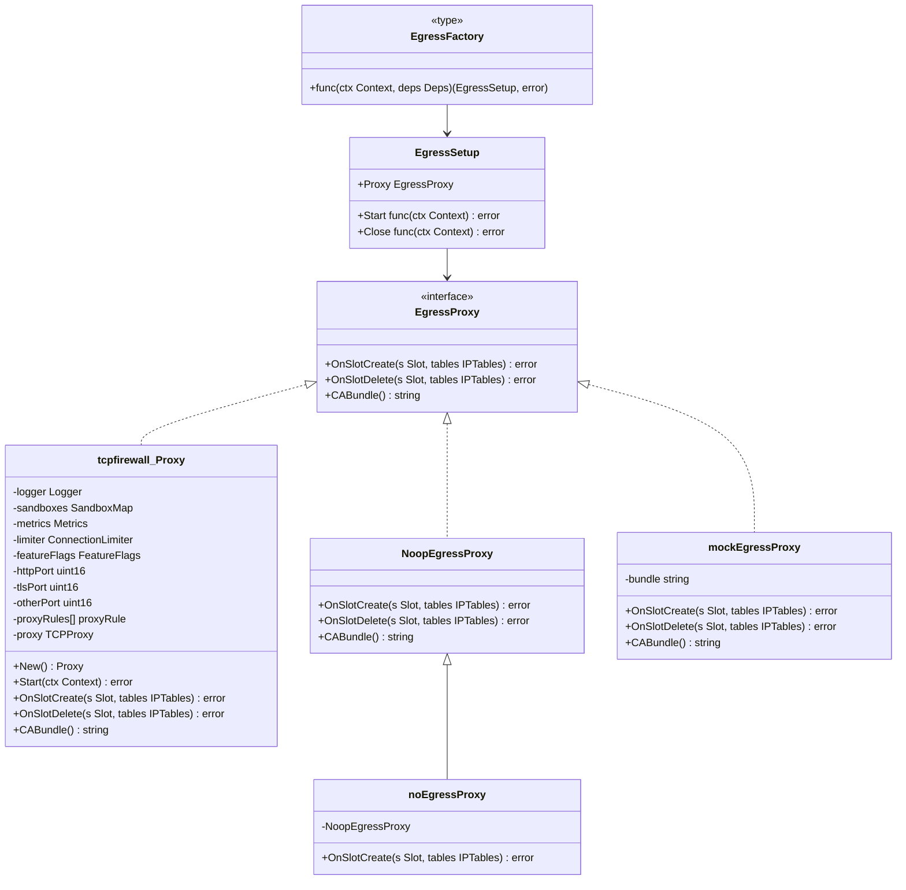
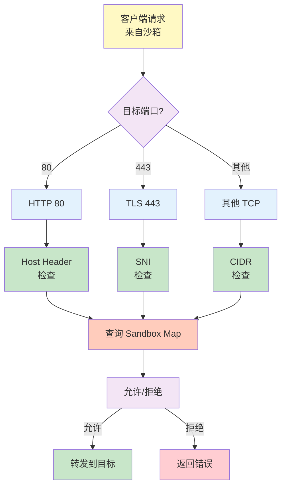
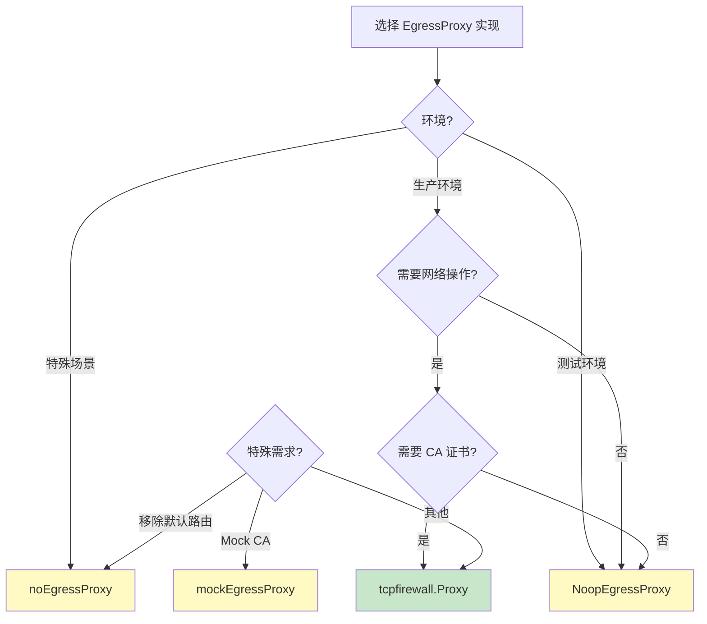
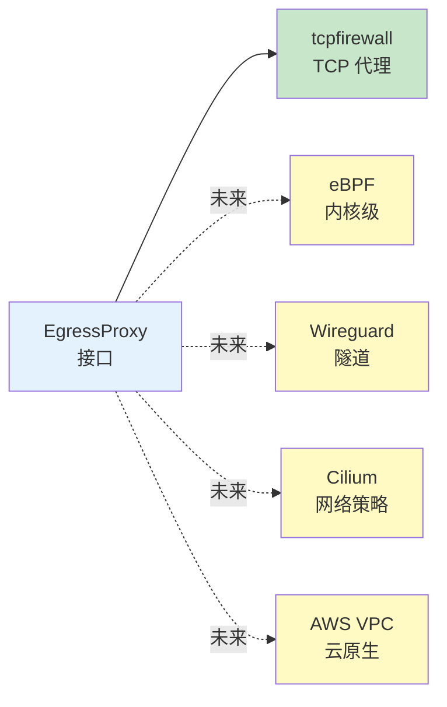

# EgressProxy 架构图

## 整体架构



## 依赖关系图

```mermaid
graph LR
    A["main.go<br/>defaultEgressFactory"]
    B["factories.Run<br/>EgressFactory"]
    C["factories/run.go<br/>opts.EgressFactory"]
    D["tcpfirewall.Proxy<br/>生产实现"]
    E["network.EgressProxy<br/>接口"]
    F["Slot<br/>网络插槽"]
    G["iptables<br/>规则配置"]
    
    A -->|注入| B
    B -->|调用| C
    C -->|创建| D
    D -->|实现| E
    E -->|管理| F
    F -->|配置| G
    
    style A fill:#ffccbc
    style B fill:#f3e5f5
    style C fill:#f3e5f5
    style D fill:#c8e6c9
    style E fill:#e3f2fd
    style F fill:#fff9c4
    style G fill:#fff9c4
```



## 流程图



## 类图



## 网络流量处理流程



## 生命周期图

```mermaid
stateDiagram-v2
    [*] --> Initialized: main.go<br/>defaultEgressFactory
    
    Initialized --> Running: Start()
    
    Running --> CreatingSlot: NewSlot()
    CreatingSlot --> SlotActive: OnSlotCreate()
    
    SlotActive --> DeletingSlot: DeleteSlot()
    DeletingSlot --> SlotDeleted: OnSlotDelete()
    
    SlotDeleted --> CreatingSlot: NewSlot()
    
    Running --> Closing: SIGTERM
    Closing --> Closed: Close()
    
    Closed --> [*]
    
    note right of Initialized
        EgressFactory 创建实例
        可以是 tcpfirewall 或 Noop
    end
    
    note right of Running
        代理服务运行
        监听网络流量
    end
    
    note right of SlotActive
        Slot 活跃
        处理流量
    end
    
    note right of Closing
        优雅关闭
        清理资源
    end
```

## 实现选择决策树



## 扩展点


